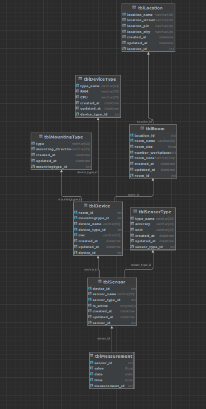

# Week 11
Use Database-Feature in PyCharm to get an overview diagram of the tables:

Eyeball the data properly, not underestimate the power of visually looking into the data!

**Unit root**
is a characteristic of a time series that makes it non-stationary.

**Dickey-Fuller test** 
Is testing for the presence of a unit root in a time series dataset and therefore if it is stationary or not. 
A unit root indicates that the time series is non-stationary, meaning its statistical properties like mean and variance change over time.

# Week 12
**Quality insights stem from quality data!**
Don't trust your plots, in timeseries decomposition we have to look at the remaining residuals to find out if a series is stationary.
Use the logger rigorously! Stop using prints to put out outputs or for debugging. A logger comes in extremly handy -> look into docs to understand this [black magic](https://docs.python.org/3/library/logging.html)
Focus on clean code!

# Week 13
Understanding the params of functions is super important to create meaningful results. See example of "period = **daily data points**" in seasonal and and classical decomposition or "regression = 'ct'"
Check for stationarity isn't simple at all.
If I start to use knew tools use a Lessonslearned journal, in which all the challenges, struggles and solutions are written down.

# Week 14
**General**
Continue with the **lessons learned journal**, in all the projects. It's not a lot of extra work and helps a lot in understanding the progress.
Continue with the **code snippet toolbox** to use for libraries, dashboards and algorithms. 
Dashboards are a powerful and useful way to look into the data visually. [DASH](https://dash.plotly.com/) Dashboards like the one presented by Gêrome are handy to have <3
Keep up the **clean code**, even if it is more cumbersome in the beginning it will **payoff**.
**Misc**
Correct predictions aren't made in a few hours. Known possible pitfalls can be avoided in the future thanks to this course.
Failure is part of Success!
Thanks a lot for the lecture it was a blast. Happy Summertime

